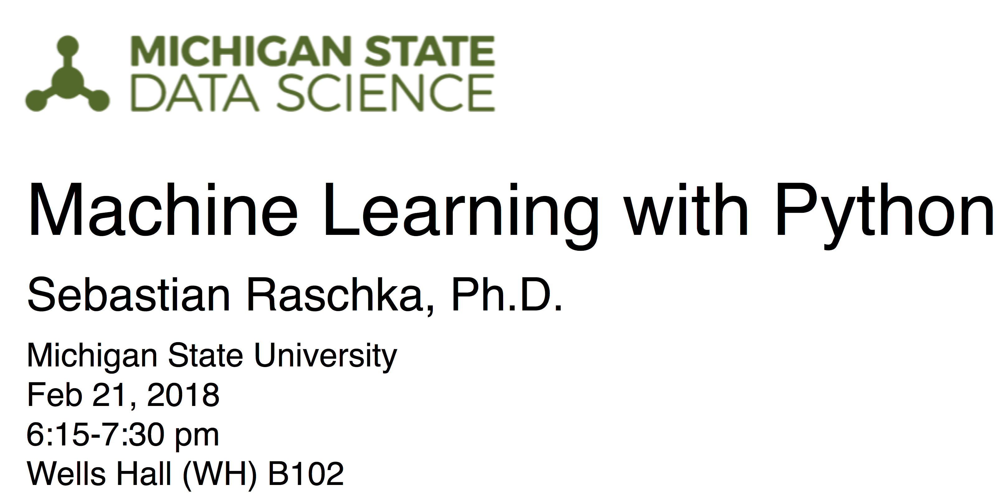
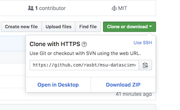
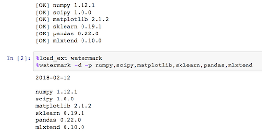

## Machine Learning with Python @ MSU Data Science 2018

### This repo is still work in progress!



This tutorial will teach you the basics of scikit-learn. I will give you a brief overview of the basic concepts of classification and regression analysis, and how to build powerful predictive models from labeled data. Although it's not a requirement for attending this tutorial, I highly recommend you to check out the accompanying GitHub repository at https://github.com/rasbt/msu-datascience-ml-tutorial-2018 1-2 days before the tutorial. During the session, we will not only talk about scikit-learn, but we will also go over some live code examples to get the knack of scikit-learn's API.   

If you have any questions about the tutorial, please don't hesitate to contact me. You can either open an "issue" on GitHub or reach me via email at mail_at_sebastianraschka.com. I am looking forward to meeting you soon!

---

- View the presentation slides <I will post the slides after the tutorial>
- View the code notebook [here](code/tutorial.ipynb) / on [nbviewer](http://nbviewer.jupyter.org/github/rasbt/msu-datascience-ml-tutorial-2018/blob/master/code/tutorial.ipynb) <will add the code notebook soon!>

---

# Schedule

This repository will contain the teaching material and other info for the *Learning scikit-learn* tutorial at the [*MSU Data Science*](http://msudatascience.com) held on February 21st 6:15-7:30 pm at Wells Hall (WH) B102.

- When? **Wed Feb 21, 2018 at 6:15 - 7:30 pm**
- Where? **Michigan State University Wells Hall (WH) B102**

I recommend watching the MSU Data Science website and Facebook group for (last minute) updates

- http://msudatascience.com/calendar/
- https://www.facebook.com/events/174671933295040/


# Obtaining the Tutorial Material

If you already have a GitHub account, the probably most convenient way to obtain the tutorial material is to clone this GitHub repository via `git clone https://github.com/rasbt/msu-datascience-ml-tutorial-2018` and fetch updates via `pull origin master`

If you don’t have an GitHub account, you can download the repository as a .zip file by heading over to the GitHub repository (https://github.com/rasbt/msu-datascience-ml-tutorial-2018) in your browser and click the green “Download” button in the upper right.




# Installation Notes and Requirements

Please note that installing the following libraries and running code alongside is **not a hard requirement for attending the tutorial session**, you will be able to follow along just fine (and probably be less distracted :)). Now, the tutorial code should be compatible to both Python 2.7 and Python 3.x. but will require recent installations of

- [NumPy](http://www.numpy.org)
- [SciPy](http://www.scipy.org)
- [matplotlib](http://matplotlib.org)
- [pandas](http://pandas.pydata.org)
- [scikit-learn](http://scikit-learn.org/stable/)
- [IPython](http://ipython.readthedocs.org/en/stable/)
- [Jupyter Notebook](http://jupyter.org)
- [watermark](https://pypi.python.org/pypi/watermark)
- [mlxtend](http://rasbt.github.io/mlxtend/)

To install these libraries it's most convenient to either use [conda](https://conda.io/miniconda.html) or [pip](https://pip.pypa.io/en/stable/), e.g.,

    conda install numpy

or

    pip install numpy

etc.


Please make sure that you have these libraries installed in your current Python environment prior to attending the tutorial if you want to execute the code examples that are executed during the talk. Please also note that executing these examples during/after the talk is merely a suggestion, not a requirement. **I highly recommend you to open the code/check_environment.ipynb](code/check_environment.ipynb) notebook as a Jupyter notebook**, for instance by the notebook via

```bash
jupyter notebook <path-to>/msu-datascience-ml-tutorial-2018/code/check_environment.ipynb
```
and executing the code cells:


